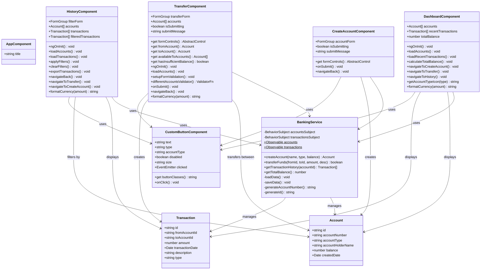
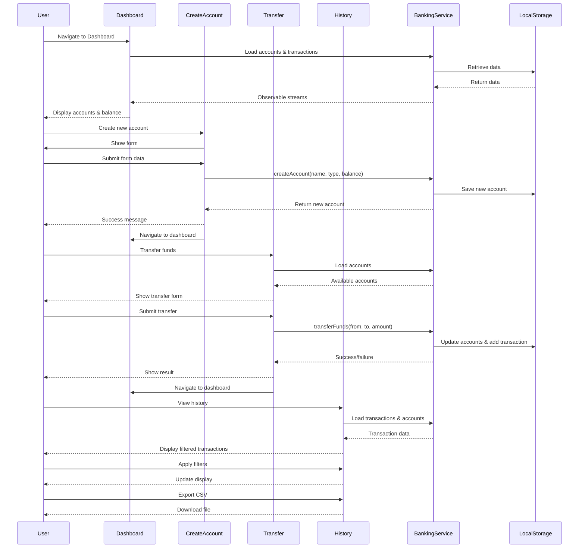
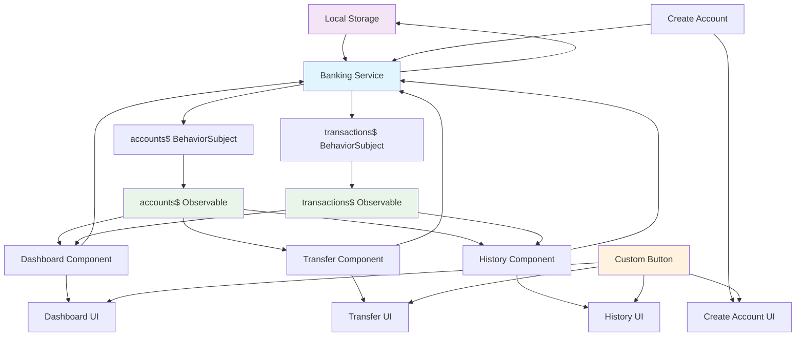
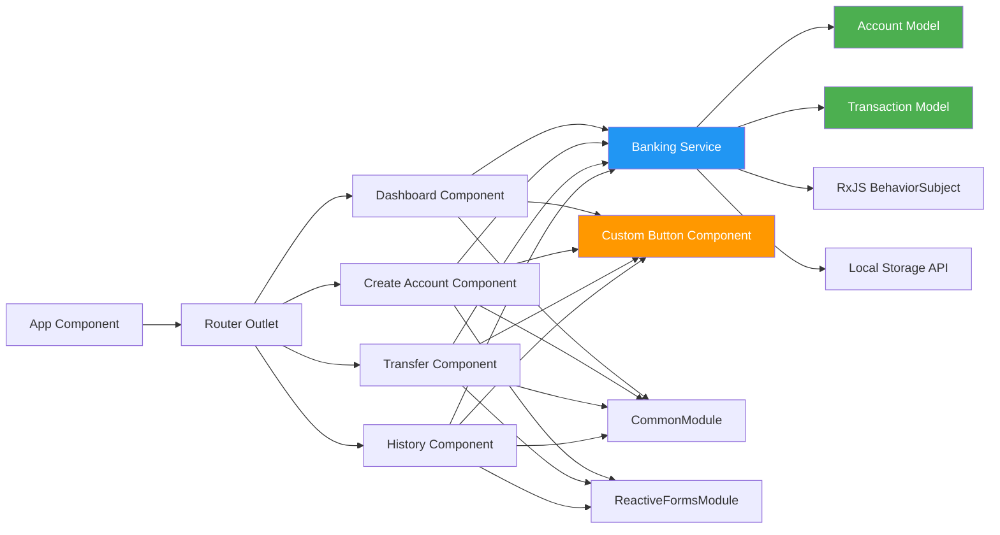
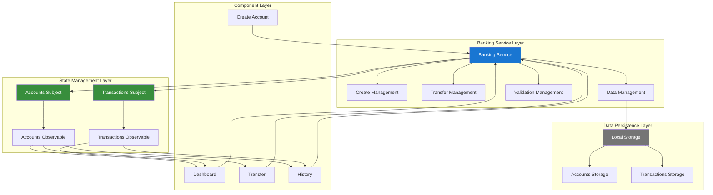

# 🏦 Banking Transactions Web Application

A complete banking web application built with **Angular 20** and **Bootstrap** that allows users to manage multiple accounts and transfer funds between them.

## 🎯 Application Structure

```
src/app/
├── models/                     # Data models
│   ├── account.ts             # Account interface
│   └── transaction.ts         # Transaction interface
├── services/                   # Business logic services
│   └── banking.ts             # Banking service (CRUD operations)
├── shared/                     # Shared components
│   └── components/
│       └── custom-button/     # Reusable button component
├── pages/                     # Page components
│   ├── dashboard/            # Main dashboard
│   ├── create-account/       # Account creation
│   ├── transfer/             # Fund transfer
│   └── history/              # Transaction history
└── app.routes.ts             # Application routing
```

## 🏗️ Architecture & UML Diagrams

### 📊 System Class Diagram



### 🔄 Component Interaction Flow



### 🎯 Data Flow Architecture



### 🧩 Component Dependency Graph



### 🔧 Service Architecture



## 🌟 Features

### Core Functionality
- ✅ **Create new user accounts** with initial balance
- ✅ **Transfer funds** from one account to another
- ✅ **View transaction history** for any given account
- ✅ **Real-time balance updates** and transaction tracking

### User Interface Design
- 🎨 **Intuitive, user-friendly interface** with modern Bootstrap styling
- 📱 **Responsive design** that works on all devices
- ✨ **Custom reusable button component** with account type-specific styling
- 🔄 **Conditional button rendering** based on account type selection

### Account Creation & Conditional Styling
- 💳 **Account Type Selection**: Choose between Chequing or Savings accounts
- 🎯 **Conditional Button Styling**: 
  - **Chequing Account**: Green gradient buttons
  - **Savings Account**: Orange/yellow gradient buttons
- 📄 **Account Type Radio Buttons**: Easy selection with visual feedback
- 🔘 **Dynamic Button Text**: Button displays account type-specific text

### Form Validations
- 🛡️ **Comprehensive Input Validation**:
  - **Balance cannot be negative**
  - **Appropriate input types** (text for names, number for balance, radio for account type)
  - **Real-time validation feedback**
  - **Required field validation**
  - **Character limits** and **min/max values**

### Advanced Features
- 📊 **Transaction Statistics**: Total transactions, money in/out
- 🔍 **Advanced Filtering**: Filter by account, date range, transaction type
- 📈 **Portfolio Overview**: Total balance across all accounts
- 📄 **Export Functionality**: Download transaction history as CSV
- 💾 **Local Storage**: Data persistence across browser sessions

## 🚀 Technology Stack

- **Frontend Framework**: Angular 20.2.1 (Latest)
- **Styling**: Bootstrap 5 + Custom CSS
- **Forms**: Angular Reactive Forms with FormBuilder and FormControls
- **Icons**: Font Awesome 6
- **State Management**: RxJS Observables with BehaviorSubject
- **Build Tool**: Angular CLI with Vite
- **Node.js**: v22.18.0 (Latest LTS)

## 📋 Requirements Fulfilled

### ✅ Technology Requirements
- [x] **Angular** for the front-end framework
- [x] **Bootstrap** for styling and responsive design

### ✅ Core Functionality
- [x] **Create a new user account** with an initial balance
- [x] **Transfer funds** from one account to another
- [x] **View transaction history** for any given account

### ✅ User Interface (UI) Design
- [x] **Intuitive, user-friendly interface**
- [x] **Angular's FormBuilder and FormControls** for UI components
- [x] **Well-structured and easy to manage forms**

### ✅ Account Creation with Conditional Styling
- [x] **Account type selection** (Chequing or Savings) via radio buttons
- [x] **Conditional button rendering** based on account type
- [x] **Different button styles** for different account types

### ✅ Form Validations
- [x] **Reasonable input validators**
- [x] **Balance cannot be negative**
- [x] **Suitable input types** for different fields
- [x] **Character limits** (names: max 50 chars)

### ✅ Reusable Components
- [x] **Custom, reusable button component**
- [x] **Incorporated into the application**
- [x] **Placed in a shared module** (separate from main module)

## 🏃‍♂️ Quick Start

### Prerequisites
- Node.js v22.12+ (recommended: v22.18.0)
- npm v10.9+
- Angular CLI v20.2+

### Installation & Setup
```bash
# Navigate to project directory
cd angular_bank/banking-app

# Install dependencies
npm install

# Start development server
ng serve

# Open in browser
http://localhost:4200
```

## 💡 Usage Guide

### 1. **Dashboard** 📊
- View all your accounts and balances
- See recent transaction activity
- Quick access to all banking functions
- Portfolio overview with total balance

### 2. **Create Account** ➕
- Enter account holder name
- Choose account type (Chequing/Savings)
- Set initial balance (minimum $0.00)
- Account number auto-generated

### 3. **Transfer Funds** 💸
- Select source account (with balance display)
- Choose destination account
- Enter transfer amount (with balance validation)
- Add optional description
- Real-time balance verification

### 4. **Transaction History** 📈
- Filter by specific account
- Date range filtering
- Transaction type filtering
- Export data to CSV
- Detailed transaction information

## 🔧 Key Components

### Custom Button Component
```typescript
<app-custom-button
  text="Create Account"
  [accountType]="'Chequing'"
  type="primary"
  size="lg"
  [disabled]="false"
  (clicked)="onSubmit()">
</app-custom-button>
```

### Banking Service Features
- **Account Management**: Create, read, update accounts
- **Transaction Processing**: Transfer funds with validation
- **Data Persistence**: Local storage integration
- **Real-time Updates**: Observable-based state management

### Form Validation Examples
```typescript
// Account creation form
this.accountForm = this.fb.group({
  accountHolderName: ['', [Validators.required, Validators.minLength(2), Validators.maxLength(50)]],
  initialBalance: [0, [Validators.required, Validators.min(0)]],
  accountType: ['Chequing', Validators.required]
});

// Transfer form with custom validators
this.transferForm = this.fb.group({
  fromAccountId: ['', Validators.required],
  toAccountId: ['', Validators.required],
  amount: ['', [Validators.required, Validators.min(0.01)]],
  description: ['', [Validators.maxLength(100)]]
});
```

## 🎨 Design Features

- **Modern Banking UI**: Professional gradient headers and card designs
- **Account Type Indicators**: Visual badges and icons for different account types
- **Responsive Grid Layout**: Works seamlessly on desktop, tablet, and mobile
- **Interactive Feedback**: Hover effects, loading states, and success/error messages
- **Accessibility**: Proper ARIA labels, semantic HTML, and keyboard navigation

## 🔐 Security & Validation

- **Client-side Validation**: Comprehensive form validation with real-time feedback
- **Business Logic Validation**: Prevent invalid transfers (insufficient funds, same account)
- **Data Integrity**: Type-safe models and interfaces
- **Error Handling**: Graceful error handling with user-friendly messages

## 📱 Mobile-First Design

- **Responsive Navigation**: Collapsible navbar for mobile devices
- **Touch-Friendly Interface**: Large buttons and intuitive gestures
- **Optimized Forms**: Mobile-friendly form layouts and input types
- **Performance**: Lazy-loaded routes and optimized bundle size

## 🚀 Performance Features

- **Lazy Loading**: Route-based code splitting
- **OnPush Strategy**: Optimized change detection (when applicable)
- **Local Storage**: Fast data persistence and retrieval
- **Minimal Dependencies**: Lightweight, focused feature set

## 🔮 Future Enhancements

- **User Authentication**: Login/logout functionality
- **Account Categories**: Savings goals, investment accounts
- **Recurring Transfers**: Scheduled automatic transfers
- **Transaction Categories**: Expense categorization and budgeting
- **Real Backend Integration**: REST API integration
- **Advanced Reporting**: Charts, graphs, and financial insights

---

## 👨‍💻 Development

This application demonstrates modern Angular development practices including:
- **Standalone Components**: No NgModules required
- **Reactive Forms**: Type-safe form handling
- **RxJS Observables**: Reactive state management
- **TypeScript**: Strong typing for better development experience
- **Component Architecture**: Modular, reusable components
- **Modern CSS**: Flexbox, Grid, and CSS Variables

**Author**: Built with Angular 20 and modern web technologies  
**License**: MIT  
**Version**: 1.0.0
